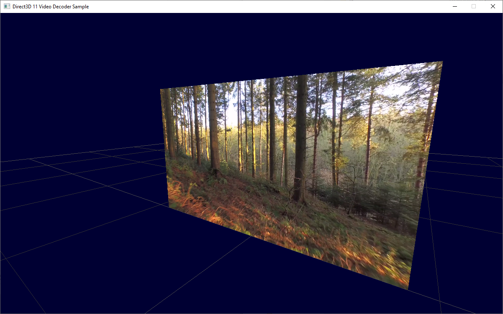

### Sample project to play .mp4 files with DX11

This is a sample I would have like to have found long time ago, but I was unable to find a simple sample to play mp4 videos using DX11.

I'm using Media Foundation API to decode the mp4 file. The resulting frames come in IYUV format. If I force the output of the MF to be RGBA the performance drops dramatically. So instead we upload the output buffer to a single dynamic directX texture. One area of that texture will hold the Y and another will hold the UV data. Then, a pixel shader is used to do the conversion from YUV to RGB. 

The required code is inside video_texture.cpp and video.hlsl. video_texture.h is just a facade to hide all the MF API to everybody else.

I have tried to use the NV12 format without success because the layout of the YUV data in the NV12 does not match the layout in the IYUV format. (UV data are interleaved)
Instead, the directX textures I use have the format DXGI_FORMAT_R8_UNORM, and in the pixel shader I sample the Y, U and V information playing with the texture coords.

Just for reference, a frame with size 8x4 returned by the MF library in IYUV has the following layout: ([https://docs.microsoft.com/en-us/windows/win32/medfound/recommended-8-bit-yuv-formats-for-video-rendering])

```
  Luminance: 8x4 followed by U4x4, followed by V4x4
  Y00 Y01 Y02 Y03 Y04 Y05 Y06 Y07       Y00 Y01 Y02 Y03 Y04 Y05 Y06 Y07
  Y10 Y11 Y12 Y13 Y14 Y15 Y16 Y17       Y10 Y11 Y12 Y13 Y14 Y15 Y16 Y17
  Y20 Y21 Y22 Y23 Y24 Y25 Y26 Y27       Y20 Y21 Y22 Y23 Y24 Y25 Y26 Y27
  Y30 Y31 Y32 Y33 Y34 Y35 Y36 Y37   =>  Y30 Y31 Y32 Y33 Y34 Y35 Y36 Y37
  U00 U02 U04 U06                       U00 U02 U04 U06 U20 U22 U24 U26
  U20 U22 U24 U26                       V00 V02 V04 V06 V20 V22 V24 V26
  V00 V02 V04 V06
  V20 V22 V24 V26
```

So, when uploading the data to the GPU I add some padding to the UV lines (wasting a bit of texture data, and limiting any type of wrap mapping but...)

```
  New Layout: 8x4 followed by U4,Pad, U4,Pad, V4,Pad, V4,Pad
  Y00 Y01 Y02 Y03 Y04 Y05 Y06 Y07 
  Y10 Y11 Y12 Y13 Y14 Y15 Y16 Y17
  Y20 Y21 Y22 Y23 Y24 Y25 Y26 Y27 
  Y30 Y31 Y32 Y33 Y34 Y35 Y36 Y37 

  U00 U02 U04 U06  0   0   0   0
  U20 U22 U24 U26  0   0   0   0
  V00 V02 V04 V06  0   0   0   0
  V20 V22 V24 V26  0   0   0   0
```

For a video of WxH resolution, we need to allocate a single texture of Wx(Hx2) with format R8 (1bytes per texel)

  Accessing the Y texture requires scaling the Y component by 0.5. 
  For U, multiply the y component of the texture coordinate by 0.5 and add 0.5. 
  Finally, for the V also multiply by 0.5 and add 0.75 to match the start of the V data in the texture. 
  Then use your favourite YUV 2 RGB formula to obtain the final RGB color.

In my machine the full operation in the CPU takes less than 0.5ms for a full 1080 video.

Final note, when playing videos with vertical resolution not multiple of 16, the MF Api properly returns the correct video size, like 1080, but then in the first frame it reports a media type change event, to report the a 1088 vertical resolution. That's why I wait until the first frame is decoded to create the DX textures.

No synchronization primitive is performed beyond checking if a new frame should be decoded as it's now superfast and the MF provide absolute times for each frame.

No audio output or playing is provided, but MF can provide this data also.

In previous versions I was using two separate textures, one for the Y and another for the UV, but I think that spending a little bit more of GPU texture to have all the YUV information in the single texture makes live easier for eveybody. We are still copying the same amount of data, just changing the layout.

## Credits

Most of the MF code is taken directly from the Microsoft sample mediafoundationsamples\MFMP4ToYUVWithoutMFT
The sample video has been downloaded from www.videvo.net

